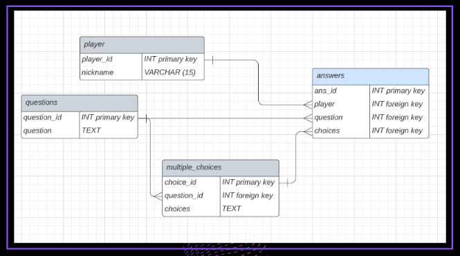

# The Ice Melter App - Backend API

This API provides backend and database support for The Ice Melter App frontend repo.


## This Repo Contains
 - Db folder: Contains helper scripts for resetting the database
 - Models folder: Contains 3 models documents which each contain functions that handle the logic for the routes
 - Routes: Contains 3 CRUD routers - each one is served by one of the above models documents
 - App.js: The server
 - package.json, package-lock.json,.gitignore, serverplan.md: - these can all safely be ignored
 
## How To Run Locally

Clone the project

```bash
  git clone https://github.com/SchoolOfCode/bc13_w9_project-backend-let-s-git-on
```

Go to the project directory

```bash
  cd bc13_w9_project-frontend-let-s-git-on
```

Install dependencies

```bash
  npm install
```
Get the database working

 - Set up an empty postgres database via a cloud-hosted database website 
 - Copy the link for your cloud-hosted database
 - Create a .env file and put the below code in it as well as your link

 ```bash
    POSTGRES_CONNECTION_URL = *your db link here*
    PORT=3000
```

Start the server

```bash
  npm run dev
```

Reset the tables

```bash
  npm run db-reset
```
## API Reference Tables

#### Existing Routes


| Method | Path           | Additional Info                   | Result  | Response   |
| :------| :-------       | :-------------------------------- | :-------| :--------- |
| GET    | /api/questions |                                   | Gets all questions   | { success: Boolean, payload: An array of objects containing all questions } |
| GET    | /api/questions/:id | ID required | Gets question with given ID if it exists | { success: Boolean, payload: An array of objects containing the question and all it's answers } |
| GET    | /api/players/ |  | Gets all players| { success: Boolean, payload: An array of objects containing all player IDs and nicknames} |
| GET    | /api/players/:id  | ID required | Gets player with Given ID if they exist | { success: Boolean, payload: An array with an object for each answer the player chose with their nickname and the question text in each as well} |
| POST    | /api/players/  | { body } | Adds a new player to the database | { success: Boolean, payload: An object containing posted nickname and db assigned ID } |
| DELETE   | /api/players/:id  | ID required | Deletes a player and their answers | { success: Boolean, payload: An objects containing the deleted player's nickname and ID } |
| POST    | /api/answers | { body } | Adds an answer, question and player ID to the answers table | { success: Boolean, payload: An object containing the player's id, their choice, the question they answered and the answers table primary key } |
| GET    | /api/answers |  | Gets all answers | { success: Boolean, payload: An array of objects containing all the answers and their associated questions } |
| GET    | /api/answers/:id | ID required | Gets answer by player ID | { success: Boolean, payload: An object containing the player's id, their choice, the question they answered and the answers table primary key } |

## Entity Relationship Diagram

(Please use the db-reset script to auto-fill your empty database)

For reference only:

<br/>

## Languages

This repo uses: <i>JavaScript, PostgreSQL</i>

## Libraries, Frameworks and Packages

This repo uses: <i>Node.js, Nodemon, Dotenv, Express.js, PG, CORS, Morgan</i>

## Authors

- [@aliafarhana88](https://github.com/aliafarhana88)
- [@BenPuusta](https://github.com/BenPuusta)
- [@suzi-Clark](https://github.com/Suzi-Clark)
- [@B2ella](https://github.com/B2ella)

